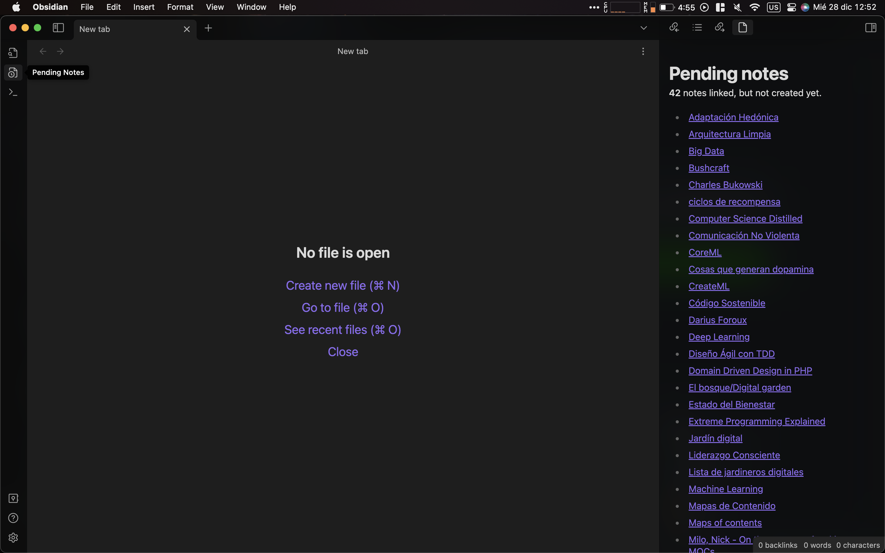

# Obsidian Pending Notes Plugin

This is a plugin for [Obsidian](https://obsidian.md).

The aim of **Pending Notes** is to find in one place all the links you have created on the fly while writing, but there land to no notes yet.

You can use it from right side bar or through the command palette:

## Support 

If you find this plugin useful, you can support me [buying me a pizza](https://www.buymeacoffee.com/ulisesantana).