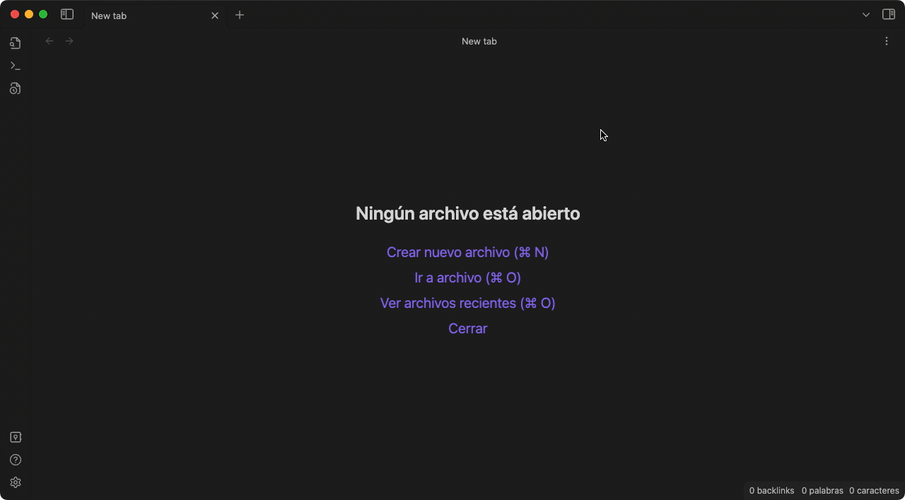

# Obsidian Pending Notes Plugin
<a href="https://www.buymeacoffee.com/ulisesantana" target="_blank"></a>

This is a plugin for [Obsidian](https://obsidian.md).

Pending Notes aims to collect in one place all the links you have created on the fly while writing, but links to nowhere yet. With this plugin, you can create those notes easily.



You can use it from right side bar or through the command palette:


## How to install

This plugin is currently pending to be added to the Obsidian Community Plugins. Meanwhile you can install it manually in two ways: 

### Manual install: download release 
Go to [the latest release](https://github.com/ulisesantana/obsidian-pending-notes/releases/latest) and download the zip file that looks like `obsidian-pending-notes-X.X.X.zip`.

Once download is finished you can unzip it inside your vault on `.obsidian/plugins/`. If you are not doing this through your terminal or console, you may need to *hidden files* on your file browser.

After that you can activate it on your Obsdian settings. If the plugin is not showed try to restart Obsdian.

### Manual install: build plugin
Go to `.obsidian/plugins/` and run:

```shell
$ git clone https://github.com/ulisesantana/obsidian-pending-notes.git
$ cd obsidian-pending-notes
$ npm run deploy
```

After that you can activate it on your Obsdian settings. If the plugin is not showed try to restart Obsdian.

**Note**: For build the plugin you will need installed git and [Node.js](https://nodejs.org/en/) at LTS version.

## Support 

If you find this plugin useful, you can support me [buying me a coffee](https://www.buymeacoffee.com/ulisesantana).